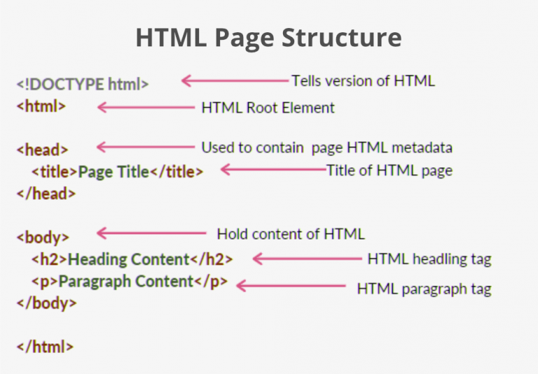
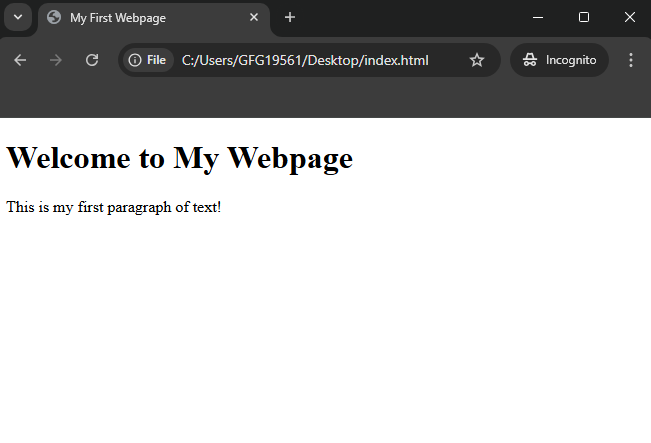

# Pengantar HTML
**HTML** adalah singkatan dari **HyperText Markup Language** . Bahasa ini adalah bahasa standar yang digunakan untuk membuat dan menyusun konten di web.

- HTML adalah bahasa markup, bukan bahasa pemrograman, artinya ia memberi anotasi pada teks untuk menentukan bagaimana teks itu disusun dan ditampilkan oleh peramban web.
- Ia membentuk blok pembangun semua situs web dan dilengkapi oleh CSS untuk tampilan dan JavaScript untuk interaktivitas.

Singkatnya, HTML adalah tentang **mengatur dan menampilkan informasi** pada halaman web. Kita dapat menganggapnya sebagai **tulang punggung** atau **struktur** halaman web.
## Contoh Kode HTML Dasar
```html
<!DOCTYPE html>
<html>

<head>
    <title>My First Webpage</title>
</head>

<body>
    <h1>Welcome to My Webpage</h1>
    <p>This is my first paragraph of text!</p>
</body>

</html>
```

## Daftar Isi
- [Mengapa Belajar HTML?](#mengapa-belajar-html)
- [Fitur HTML](#fitur-html)
- [Elemen HTML dan Tag HTML](#elemen-html-dan-tag-html)
- [Struktur Halaman HTML](#struktur-halaman-html)
- [Peramban Web](#peramban-web)
- [Sejarah HTML](#sejarah-html)
- [Keuntungan HTML](#keuntungan-html)
- [Kekurangan HTML](#kekurangan-html)

## Mengapa Belajar HTML?
Berikut adalah **5 alasan umum untuk mempelajari HTML** :
1. **Membangun Situs Web** : HTML adalah blok dasar untuk membuat situs web apa pun. Mempelajari HTML dapat membantu Anda mengejar karier di bidang pengembangan web.
2. **Sesuaikan Konten** : Memungkinkan Anda mengedit atau mengubah halaman web, email, atau templat agar sesuai dengan kebutuhan Anda.
3. **Memahami cara kerja web** : Membantu Anda memahami cara kerja internet dan bagaimana halaman web terstruktur.
4. **Peluang Kerja** : Menurut Biro Statistik Tenaga Kerja, proyeksi pekerjaan untuk pengembang web akan tumbuh 16% antara tahun 2022-2032, jauh lebih cepat daripada rata-rata di semua pekerjaan.
5. **Belajar dengan Mudah** : HTML mudah dipahami oleh pemula, menjadikannya langkah awal yang baik menuju dunia coding dan teknologi
## Fitur HTML
- Mudah dipelajari dan mudah digunakan.
- Bersifat independen terhadap platform.
- Gambar, video, dan audio dapat ditambahkan ke halaman web.
- Hiperteks dapat ditambahkan ke teks.
- Ini adalah bahasa markup.
## Elemen HTML dan Tag HTML
Elemen HTML dan Tag HTML saling terkait tetapi berbeda. **Elemen HTML** adalah struktur lengkap, termasuk tag pembuka, konten (jika ada), dan tag penutup (jika ada).

Di sisi lain, **tag** A adalah kata kunci atau nama sebenarnya yang diapit tanda kurung siku (`< >`) yang memberi tahu browser jenis konten apa yang diharapkan.


## Struktur Halaman HTML
Struktur dasar halaman HTML ditunjukkan di bawah ini. Halaman ini berisi elemen-elemen penyusun penting (yaitu deklarasi doctype, HTML, head, title, dan body) yang menjadi dasar pembuatan semua halaman web.



- `<!DOCTYPE html>` – Ini adalah deklarasi tipe dokumen, bukan tag. Ini menyatakan bahwa dokumen tersebut adalah dokumen HTML5.
- `<html>` – Ini disebut elemen dasar HTML. Semua elemen lainnya ada di dalamnya.
- `<head>` – Tag head berisi elemen “di balik layar” untuk halaman web. Elemen dalam head tidak terlihat di bagian depan halaman web. Elemen umum di dalam `<head>` meliputi:
	- `<title>` : Menentukan judul yang ditampilkan pada tab browser.
	- `<meta>` : Menyediakan informasi seperti set karakter atau pengaturan viewport.
	- `<link>` : Menghubungkan file style atau sumber daya eksternal.
	- `<style>` : Menanamkan style CSS internal.
	- `<script>` : Menanamkan JavaScript untuk fungsionalitas.
- `<title>` – Judul adalah apa yang ditampilkan di bagian atas browser Anda saat Anda mengunjungi situs web dan berisi judul halaman web yang sedang Anda lihat.
- `<h2>` – Tag `<h2>` adalah tag heading tingkat kedua.
- `<p>` – Tag `<p>` mewakili paragraf teks.
- `<body>` – Tag body digunakan untuk melampirkan semua konten yang terlihat pada halaman web. Dengan kata lain, konten body adalah konten yang akan ditampilkan browser di bagian depan.

Dokumen HTML dapat dibuat menggunakan **editor teks HTML**. Simpan berkas teks menggunakan ekstensi “ ****.html”**** atau “ ****.htm”**** . Setelah disimpan sebagai dokumen HTML, berkas tersebut dapat dibuka sebagai halaman web di peramban.

Kita bisa menggunakan editor teks bawaan, seperti Notepad untuk Windows, atau TextEdit untuk MacOS. Atau bisa juga menggunakan editor teks tingkat lanjut seperti **Sublime Text**, **Visual Studio Code**, dll.
## Peramban Web
Tidak seperti bahasa pemrograman lain, HTML tidak menampilkan output pada compiler. Peramban web lah yang menampilkan hasil kode HTML.

Ia membaca berkas HTML dan menentukan cara menampilkan konten dengan bantuan tag HTML. Peramban web apa pun ( **Google, Safari, Mozilla Firefox*** , dll.) dapat digunakan untuk membuka **berkas .HTML** dan melihat hasilnya.



## Sejarah HTML
Saat ini, kita menggunakan **HTML5**, yang merupakan versi HTML terbaru dan tercanggih.

HTML awalnya diciptakan oleh **Tim Berners-Lee** pada tahun 1991 sebagai cara untuk berbagi dan menyusun dokumen di web.

Versi pertama yang pernah ada adalah **HTML 1.0** , versi dasar dan terbatas. Namun, versi standar pertama, **HTML 2.0** , diterbitkan pada tahun 1995, yang menjadi dasar pengembangan web seperti yang kita kenal sekarang.


## Keuntungan HTML
- HTML digunakan untuk membangun situs web.
- Didukung oleh semua browser.
- Dapat diintegrasikan dengan bahasa lain seperti CSS , JavaScript , dll.
## Kekurangan HTML
- HTML hanya dapat membuat halaman web statis. Untuk halaman web dinamis dan logika, kita memerlukan JavaScript .
- Sejumlah besar kode harus ditulis untuk membuat halaman web sederhana.

---
## Kesimpulan
Kesimpulannya, menguasai HTML adalah langkah mendasar dalam perjalanan pengembangan web Anda. Panduan ini berfungsi sebagai sumber daya yang komprehensif untuk memahami HTML, dari dasar hingga topik yang lebih maju. Ingat, HTML lebih dari sekadar bahasa markup – ini adalah alat yang ampuh untuk membuat situs web yang menarik, mudah diakses, dan ramah SEO.
