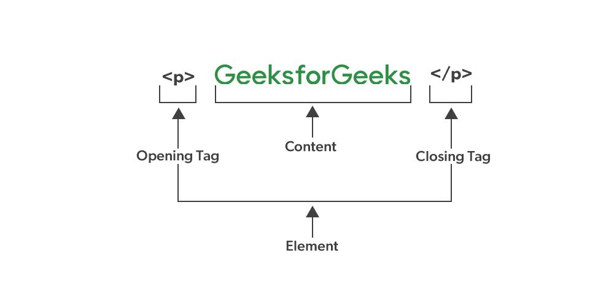
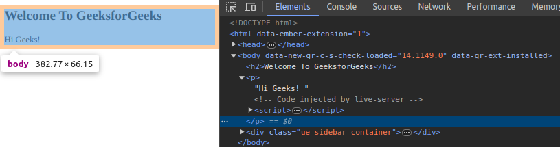

# Elemen HTML
Elemen **HTML** terdiri dari **tag pembuka** , **konten** , dan **tag penutup** , yang bersama-sama mendefinisikan struktur dan fungsi elemen. Elemen adalah blok penyusun dasar halaman web dan dapat mewakili berbagai jenis konten, seperti teks, tautan, gambar, atau judul.

Misalnya, elemen `<p>` untuk paragraf menyertakan tag pembuka dan penutup dengan konten teks di antaranya.

**Sintaksis**:
```html
<tagname> Isi Konten </tagname>
```
## Contoh Kode Elemen HTML
Dalam contoh ini `<p>` ​​adalah tag pembuka, `</p>` adalah tag penutup dan berisi beberapa konten di antara tag, yang membentuk elemen.

```html
<!-- HTML code to illustrate HTML elements -->
<!DOCTYPE html>
<html>

<head>
    <title>HTML Elements</title>
</head>

<body>
    <p>Welcome to GeeksforGeeks!</p>
</body>

</html>
```

**Daftar Isi**:
- [Beberapa Poin Penting Tentang Elemen HTML](#beberapa-poin-penting-tentang-elemen-html)
- [Elemen HTML Bersarang](#elemen-html-bersarang)
- [Perlunya Menambahkan Tag Akhir](#perlunya-menambahkan-tag-akhir)
- [Elemen Kosong HTML](#elemen-kosong-html)
- [Elemen Tingkat Blok dan Elemen Segaris](#elemen-tingkat-blok-dan-elemen-segaris)
- [Praktik Terbaik Saat Menggunakan Elemen HTML](#praktik-terbaik-saat-menggunakan-elemen-html)
## Beberapa Poin Penting Tentang Elemen HTML
**1. Sintaksis**
- Tag pembuka menunjukan di mana konten dimulai: `<tagname>`
- Tag penutup menunjukan di mana konten berakhir: `</tagname>`
- Konten sebenarnya berada di antara tag pembuka dan penutup.

**2. Sensitivitas Huruf Besar/Kecil**
- Tag HTML **tidak** peka huruf besar-kecil. Misalnya, `<B>` dan `<b>` adalah sama, untuk mencetak format tebal.
- Namun, praktik terbaikknya adalah menggunakan tag huruf kecil, demi konsistensi dan keterbacaan.
## Elemen HTML Bersarang
Elemen HTML bersarang terjadi saat satu elemen ditempatkan di dalam elemen lain, sehingga menciptakan struktur hierarki. Struktur ini penting untuk mengatur konten pada halaman web secara efektif, memastikan bahwa berbagai elemen saling berhubungan secara logis dan visual.

**Contoh**: Di sini,  tag `<html>`  berisi   tag  `<head>` dan `<body>` , membentuk struktur bersarang.

```html
<!DOCTYPE html>
<html>

<head>
    <title>HTML Elements</title>
</head>

<body style="text-align: center">
    <h1>GeeksforGeeks</h1>
    <p>Computer science portal</p>

</body>

</html>
```

Di sini, tag `<html>` berisi `<head>` dan `<body>`. Tag `<head>` dan `<body>` berisi elemen lain sehingga disebut elemen bersarang.
## Perlunya Menambahkan Tag Akhir
Untuk elemen HTML yang tidak kosong, jika Anda lupa menambahkan tag penutup atau akhir, browser modern mungkin secara otomatis menambahkannya dalam beberapa kasus.

Namun, hal ini dapat menimbulkan masalah saat Anda menambahkan elemen HTML tambahan di kemudian hari. Oleh karena itu, sebaiknya selalu sertakan tag penutup untuk elemen HTML yang membutuhkan tag penutup.

```html
<!DOCTYPE html>
<html>

<head>
    <title>HTML Elements</title>
</head>

<body>
    <h2>Welcome To GeeksforGeeks</h2>
    
    <p>Hi Geeks!

</body>

</html>
```

**Keluaran:** Gambar ini menampilkan Alat Pengembang Peramban dan Anda dapat melihat bahwa tag penutup yang hilang pada elemen paragraf dalam kode yang ditulis di atas secara otomatis ditambahkan oleh peramban tanpa menampilkan kesalahan apa pun.


## Elemen Kosong HTML
Elemen HTML tanpa konten, yaitu yang tidak mencetak apa pun disebut elemen kosong. Elemen kosong adalah elemen yang tidak memiliki konten di antara tag-nya. Tag yang menutup sendiri adalah contoh elemen kosong. Elemen HTML kosong tidak memiliki tag penutup. Misalnya, `<br>`, `<hr>`, `<link>`, `<input>` , dll, adalah elemen HTML kosong.

**Contoh** : Dalam contoh ini tag `<br>` tidak mencetak apa pun. Tag ini digunakan sebagai pemisah baris yang memisahkan baris antara tag `<h2>` dan `<p>`.

```html
<!DOCTYPE html>
<html>

<head>
    <title>Empty HTML Elements</title>
</head>

<body>
    <h2>Welcome To GfG</h2>
    <br />
    <p>Hello Geeks.</p>

</body>

</html>
```

## Elemen Tingkat Blok dan Elemen Segaris
Dalam HTML, elemen secara umum dikategorikan menjadi dua jenis utama berdasarkan cara tampilannya dalam tata letak dokumen: elemen tingkat blok dan elemen sebaris.

**1. Elemen Tingkat Blok** – Elemen tingkat blok biasanya dimulai pada baris baru dan menggunakan lebar penuh yang tersedia, terlepas dari lebar kontennya yang sebenarnya. Ini berarti elemen ditumpuk secara vertikal dan dapat memuat elemen tingkat blok lainnya serta elemen sebaris. Berikut ini beberapa contoh elemen tingkat blok:

**Contoh**:

- `<div>`: Wadah serbaguna untuk elemen lainnya.
- `<p>`: Menentukan sebuah paragraf.
- `<h1>`, `<h2>`, …, `<h6>`: Elemen judul pada level berbeda.
- `<ol>`, `<ul>`: Daftar berurutan dan tak berurutan.
- `<table>`: Menentukan tabel.
- `<form>`: Digunakan untuk formulir HTML untuk mengumpulkan masukan pengguna.
- `<section>`, `<article>`, `<nav>`, `<aside>`, `<header>`, `<footer>`: Elemen semantik yang mendefinisikan area halaman web.

**2. Elemen Sebaris** – Elemen sebaris tidak dimulai pada baris baru; elemen tersebut muncul pada baris yang sama dengan konten yang berdekatan, selama masih ada ruang. Elemen tersebut hanya mengambil lebar sesuai dengan yang dibutuhkan kontennya. Elemen sebaris biasanya digunakan dalam elemen tingkat blok untuk menambahkan konten atau gaya. Berikut ini beberapa contoh elemen sebaris:

**Contoh**:

- `<span>`: Wadah sebaris serbaguna untuk mengungkapkan konten.
- `<a>`: Membuat hyperlink.
- ``: Menanamkan gambar.
- `<strong>`, `<b>`: Digunakan untuk penekanan kuat dan teks tebal.
- `<em>`, `<i>`: Digunakan untuk penekanan dan teks miring.
- `<br>`: Menyisipkan jeda baris dalam teks.
- `<input>`: Membuat kontrol interaktif untuk formulir.
## Praktik Terbaik Saat Menggunakan Elemen HTML
- **HTML Semantik** : Gunakan elemen HTML sesuai dengan tujuannya. Misalnya, gunakan elemen judul untuk judul, `<p>` untuk paragraf, dan `<a>` untuk tautan.
- **Aksesibilitas** : Tingkatkan aksesibilitas dengan menggunakan elemen yang tepat seperti `<main>`, `<aside>`, `<header>`, dan `<footer>`. Selain itu, selalu sertakan `alt` teks untuk gambar.
- **Tetap Sederhana** : Hindari kerumitan yang tidak perlu dalam struktur HTML. Gunakan elemen sesederhana mungkin untuk mencapai tata letak dan fungsi yang diinginkan.